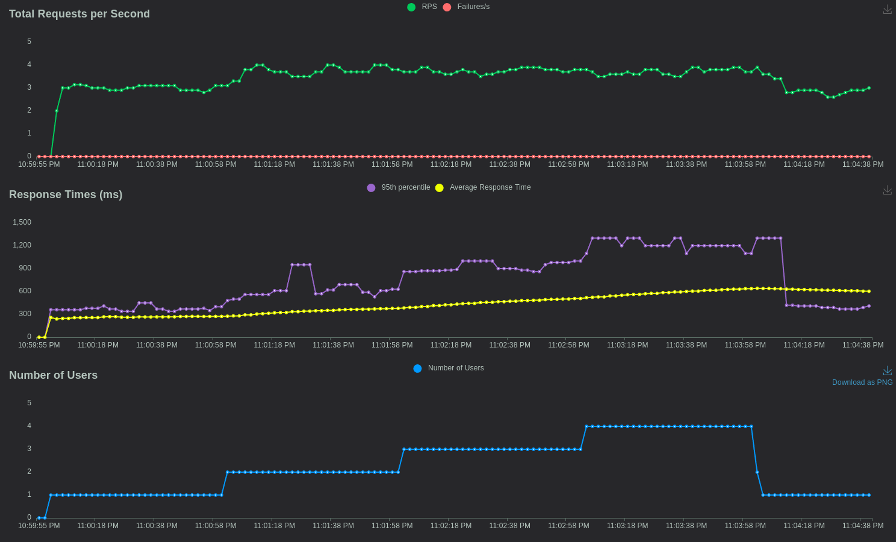
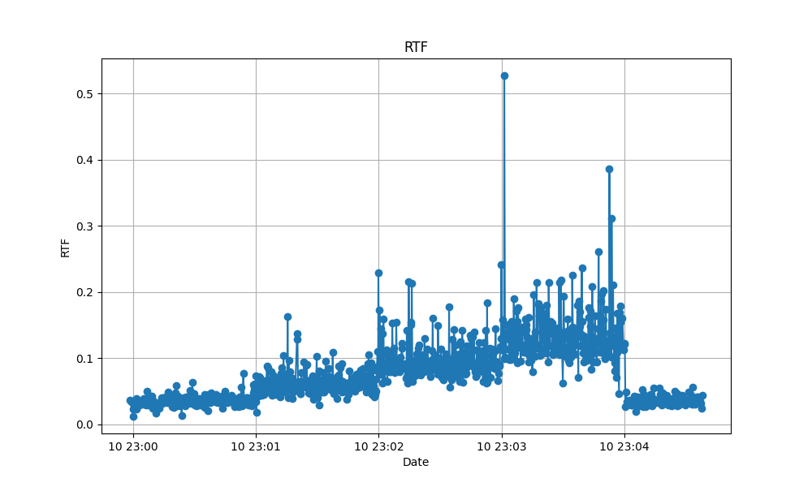

# Description

This project is a small experiment, providing an efficient Speech2Text API with Whisper (large v3) + Triton.

# Requirement

* NVIDIA GPU
* CUDA 12.3
* docker compose
* python 3.10 or later

# Build Whisper model with TensorRT-LLM

* NVIDIA Release 24.01 (build 80100513)
* Triton Server Version 2.42.0

Python Backend is already prepared, this documentation build Whisper TensorRT-LLM model in the right directory for "docker compose"

(@see https://github.com/k2-fsa/sherpa/tree/master/triton/whisper#export-whisper-model-to-tensorrt-llm for more)

```shell
mount="./models/whisper/1/whisper_large_v3:/workspace/TensorRT-LLM/examples/whisper/whisper_large_v3"
docker run -it --name "whisper-build" --gpus all --net host -v $mount --shm-size=2g soar97/triton-whisper:24.01.complete

# You are inside container under /workspace 
cd TensorRT-LLM/examples/whisper

# @see : https://github.com/k2-fsa/sherpa/tree/master/triton/whisper#export-whisper-model-to-tensorrt-llm

# take large-v3 model as an example
wget --directory-prefix=assets https://openaipublic.azureedge.net/main/whisper/models/e5b1a55b89c1367dacf97e3e19bfd829a01529dbfdeefa8caeb59b3f1b81dadb/large-v3.pt

# Build the large-v3 model using a single GPU with plugins.
python3 build.py --output_dir whisper_large_v3 --use_gpt_attention_plugin --use_gemm_plugin  --use_bert_attention_plugin --enable_context_fmha

```

You can upload directory `models/whisper` inside your own MLOPS repository.

Remove your previous build container :

```shell
docker rm "whisper-build"
```


# API 

* Rest API  : http://localhost:7000/docs#
* Websocket endpoint :  `/ws/speech2text`

# Usage

## With Streamlit

Use my cookbook : https://github.com/dminier/experiments-cookbook

## Simple test

To run both api and triton server :

```shell
docker compose up -d
```

```shell
curl -X 'POST' \   
  'http://localhost:7000/speech2text?language_code=en'  \  
   -H 'accept: application/json'  \   
   -H 'Content-Type: multipart/form-data'  \  
   -F 'file=@tests/dataset/en/en-1.wav;type=audio/wav'
```

Response :

```
" after early nightfall the yellow lamps would light up here and there the squalid quarter of the brothels"
```

Uvicorn output : 

```
2024-03-10 13:07:22.596 | DEBUG    | speech2text.application.api:speech2text:25 - 236.97 ms to transcribe en-1.wav of size 212.044 kB and content-type audio/wav
```


## Stress test

Inside `stress-tests` :

```shell
cd stress-tests
```

Only once, this script download and prepare a French datasets :

```shell
./prepare_datasets.sh
```

Run locust :

```shell
./run_locust.sh
```

Open Locust web page and simply start (stress.py contains custom load shapes):  http://0.0.0.0:8089

With my computer (AMD Ryzen 5 3600, 16Gib RAM and NVIDIA GeFORCE RTX 4070) :




You will see a file rtf_report.txt (https://openvoice-tech.net/index.php/Real-time-factor). 

After stopping locust, you can run ```python show_rtf.py```

Open rtf.png :




# References

* Whisper + Triton : https://github.com/k2-fsa/sherpa/tree/master/triton/whisper
* Speech2text client : https://github.com/yuekaizhang/Triton-ASR-Client/blob/main/client.py
* Datasets : https://www.kaggle.com/datasets/bryanpark/french-single-speaker-speech-dataset
* Wav Websocket : https://github.com/Honghe/demo_fastapi_websocket/blob/master/src/main.py

# Todo

* Better Api contract
* Batch endpoint
* some audio conversion
* Accuracy test
* Use Smaller Triton Server
